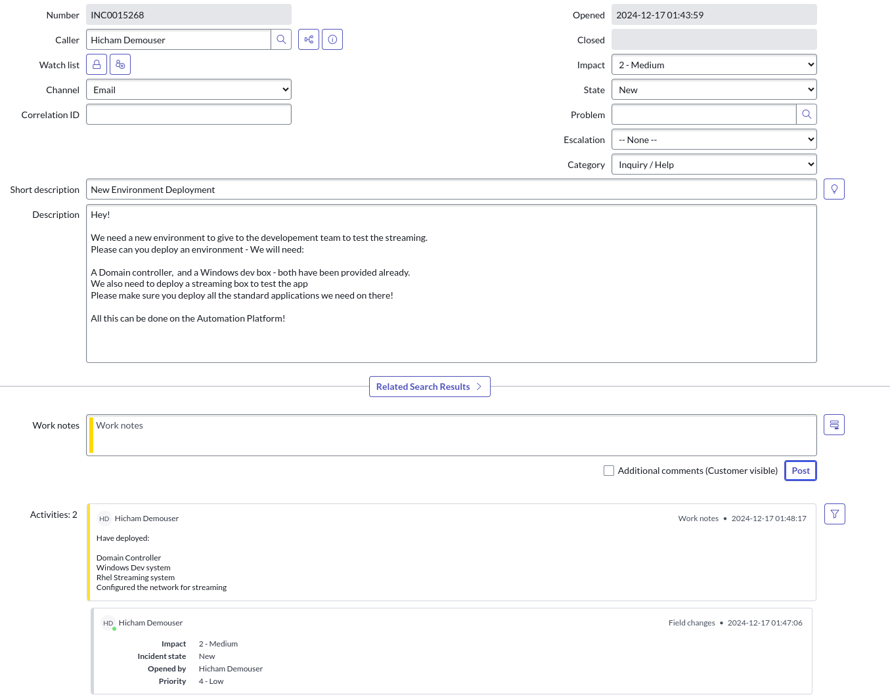
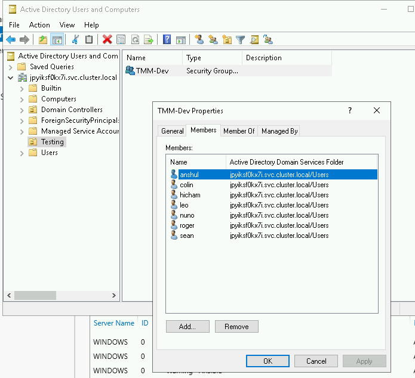
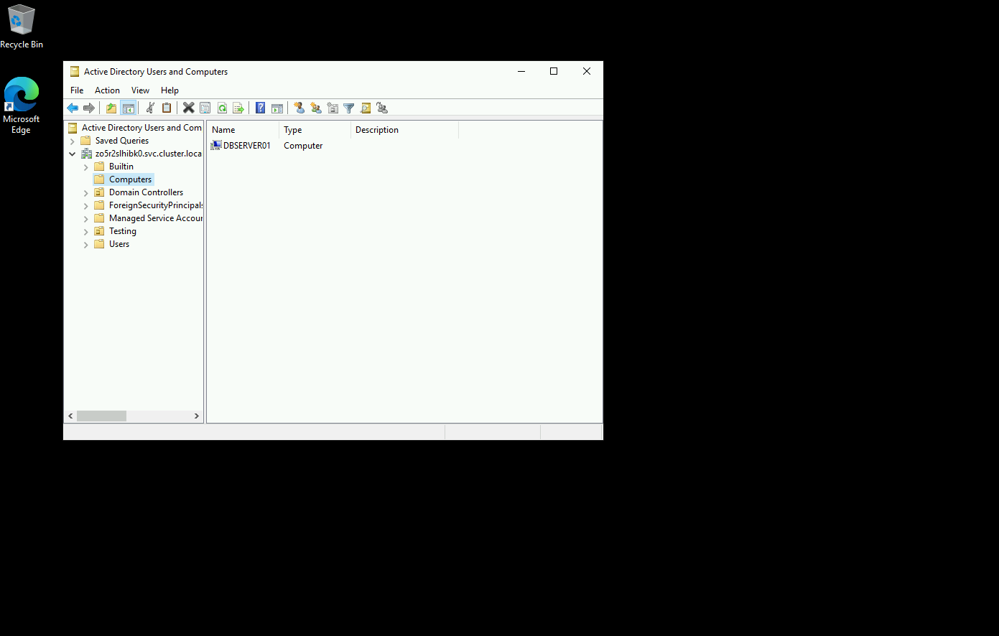
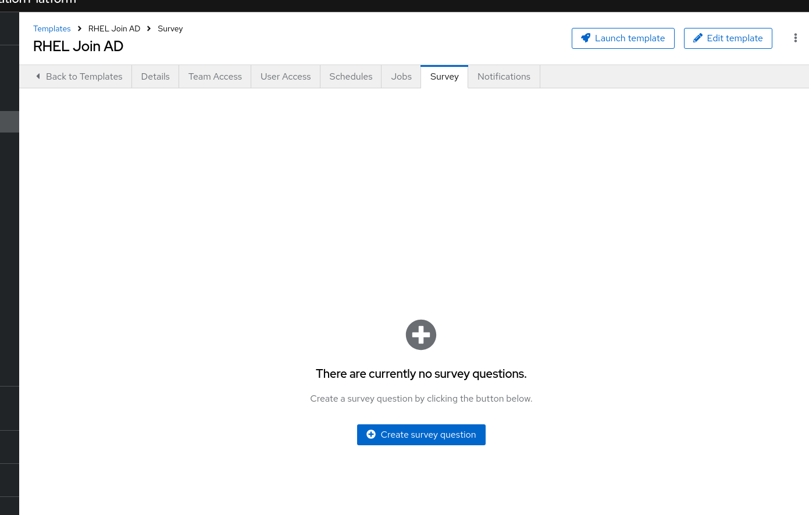
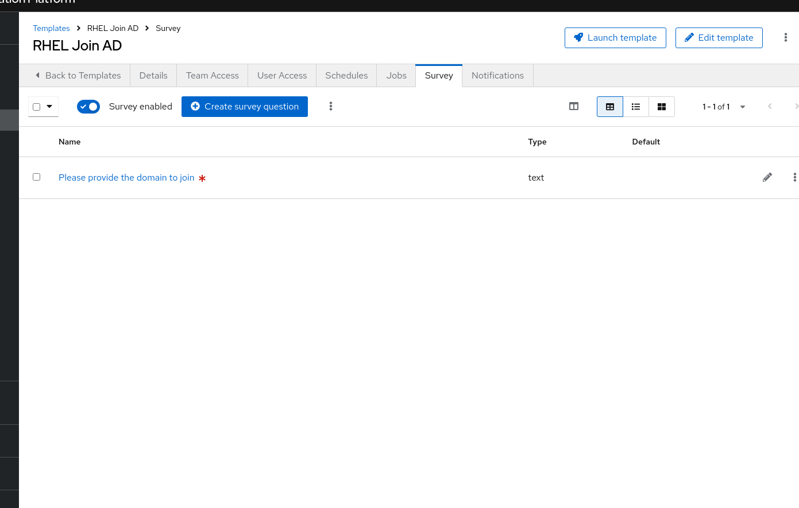
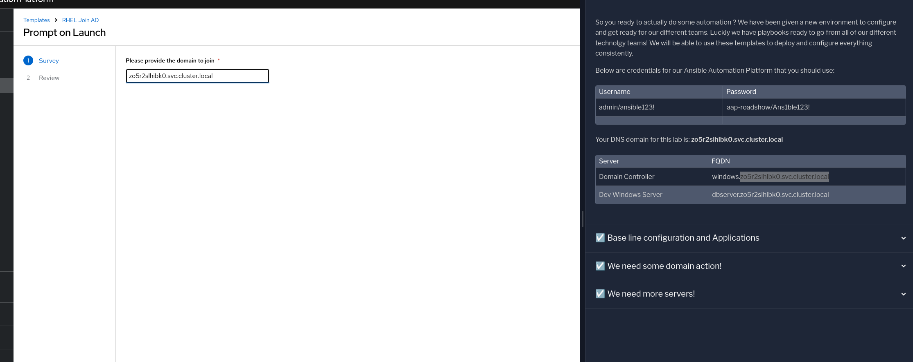
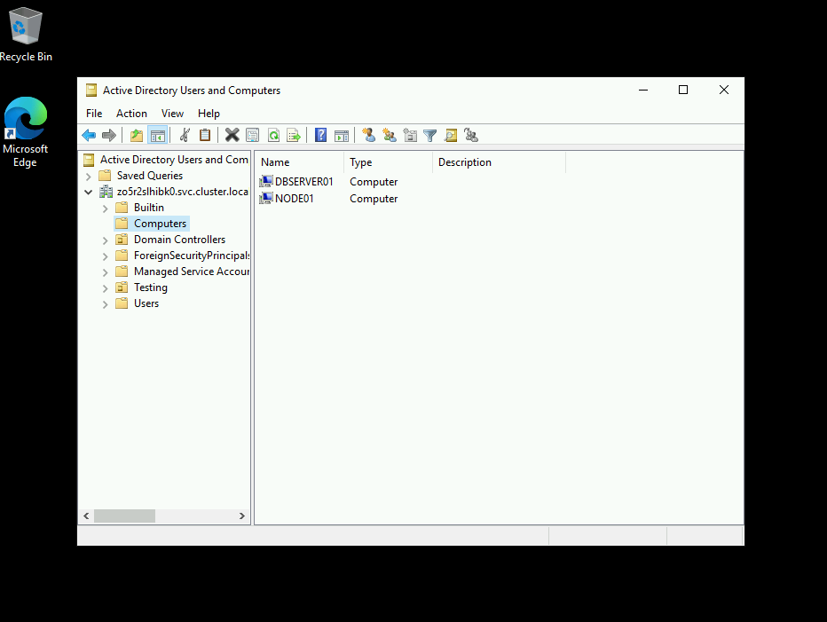

= Lab Guide: Managing Active Directory and Domain Membership
:notoc:
:toc-title: Table of Contents
:sectnums:
:icons: font

_A guide to using Ansible Automation Platform to create Active Directory objects and join both Windows and RHEL servers to a domain._

---

== Scenario: Standardized Consistency

Great job on the initial server setup. A ticket update has just arrived!

Now that you have a domain, some Windows systems, and a new RHEL system, you're ready for the next set of automation tasks. Let's get to it!

---

== Creating Active Directory Users and OUs

First, you'll create an Organizational Unit (OU) and a group for the developers, then populate it with user accounts.

. **Launch the "Windows Users and OU" template.**
+
Navigate to **Automation Execution** → **Templates**. Find and launch the **Windows Users and OU template** by clicking the launch icon (🚀).
+
NOTE: Depending on your screen resolution, this template may be on the second page of the templates list.

. **Provide the survey details.**
+
During the launch process, you'll be prompted with a survey. Use the following details for this task:
+
* **OU:** `Testing`
* **Group:** `TMM-Dev`
+
Click **Next**, then **Finish** to start the job.

. **Verify the new AD objects.**
+
Once the job is complete, navigate to the `windows` tab in your lab environment. From the Start Menu, select **Windows Administrative Tools**, then choose **Active Directory Users and Computers**. Expand your domain to confirm that the `Testing` OU, the `TMM-Dev` group, and the new developer accounts have all been successfully created.
+

---

== Joining Servers to the Domain (Optional)

With the servers configured and AD objects in place, the final step is to join the servers to the domain.

. **Join the Windows server to the domain.**
+
Navigate back to your `aap` tab. Go to **Automation Execution** → **Templates** and launch the **Windows Join Domain** job template. Once the job is complete, you can verify its success in **Active Directory Users and Computers** on the Windows server.
+

. **Add a survey to the RHEL domain join template.**
+
To make the RHEL process more flexible, let's add a survey. Navigate to **Automation Execution** → **Templates**, click on the name of the **RHEL Join AD** template, and go to the **Survey** tab.
+

+
Click **Create survey question** and configure it with the following details:
+
* **Question:** `Please provide the domain to join`
* **Description:** `Domain/Forest information`
* **Answer variable name:** `domain`
+
After creating the question, be sure to **enable the survey** using the toggle switch at the top of the page.
+

. **Join the RHEL server to the domain.**
+
Navigate back to the main **Templates** list and launch the **RHEL Join AD** template. When prompted by the survey, provide your unique lab domain:
+
**{dns_domain}**
+

+
Click **Next** to launch the job.

. **Verify both systems are in the domain.**
+
Once complete, return to the `windows` tab and refresh the **Active Directory Users and Computers** view. You should now see both the Windows and RHEL systems listed in the domain's Computers container.
+

---

== Appendix: Code Snippets

If you're interested, here are some key code snippets from the playbooks used in this lab.

=== Creating Users, Groups, and OUs in Active Directory

[source,yaml]
----
- name: Create a group in an OU
  microsoft.ad.group:
    identity: "{{ group_name }}"
    scope: global
    path: "{{ ou_path }}"
    state: present

- name: Create users for lab
  microsoft.ad.user:
    identity: "{{ item.key }}"
    password: "{{ user_password }}"
    firstname: "{{ item.value.firstname }}"
    surname: "{{ item.value.surname }}"
    state: present
    groups:
      set:
      - "{{ group_name }}"
      - Domain Users
  loop: "{{ users_list | dict2items }}"

- name: Create Ansible Admin
  microsoft.ad.user:
    identity: "{{ admin_user }}"
    password: "{{ admin_password }}"
    firstname: "Ansible AD"
    surname: "Administrator"
    state: present
    groups:
      set:
      - Domain Admins
      - Domain Users
----

=== Joining Servers to the Domain

[source,yaml]
----
- name: Join host to Domain
  microsoft.ad.membership:
    dns_domain_name: "{{ wins_domain }}"
    hostname: "{{ inventory_hostname }}"
    domain_admin_user: Administrator
    domain_admin_password: "{{ safe_password }}"
    domain_server: "{{ hostname_cleaned }}"
    state: domain
    reboot: true
----
