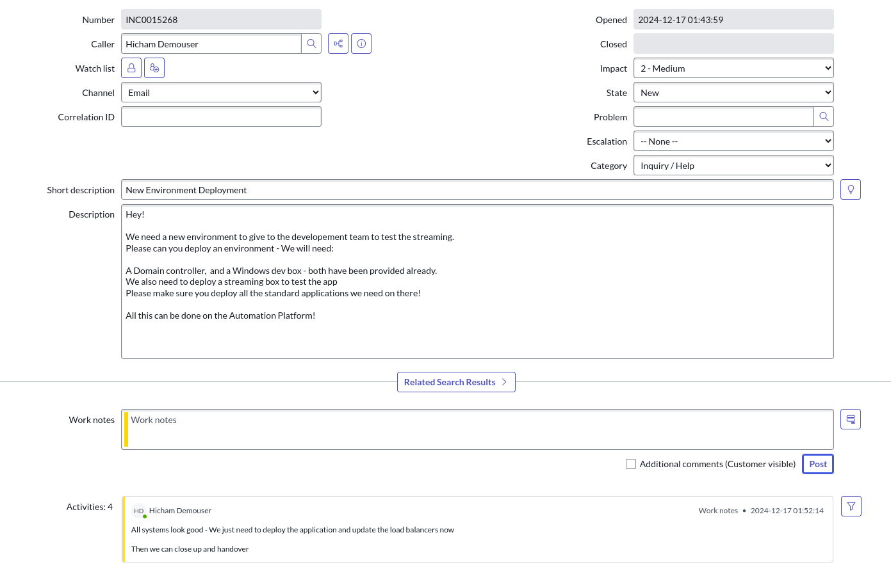
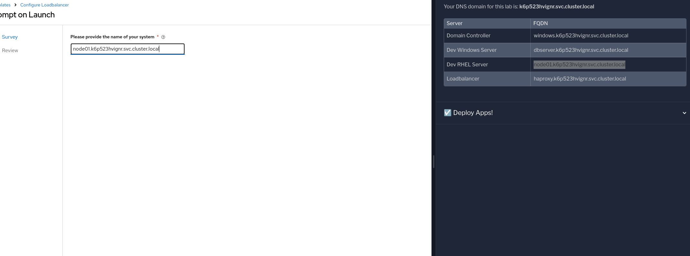

= Lab Guide: Deploying and Load Balancing a Web Application
:notoc:
:toc-title: Table of Contents
:sectnums:
:icons: font

_A guide to using Ansible Automation Platform to deploy a web application to both Windows and RHEL servers and configure an HAProxy load balancer._

---

== Scenario: Standardized Consistency

A ticket update has just arrived!

With the core infrastructure configured, you are finally ready to deploy the application and configure the load balancer before handing the environment over to the development team.

---

== Deploying the Web Application

Your first task is to deploy the web application to both the Windows (IIS) and RHEL (Apache) servers.

. **Deploy the web app to the Windows server.**
+
Navigate to your `aap` tab. Go to **Automation Execution** → **Templates** and launch the **Windows Deploy WebApp** job template. This will configure the Windows server to host the web application on IIS.

. **Verify the Windows web app.**
+
Once the job is complete, navigate to the `webapp-windows` tab in your lab environment to view the running application.
+

. **Deploy the web app to the RHEL server.**
+
Return to the `aap` tab. Go to **Automation Execution** → **Templates** and launch the **RHEL Deploy WebApp** job template. This will configure the RHEL server to host the same web application on Apache.

. **Verify the RHEL web app.**
+
Once the job is complete, navigate to the `webapp-rhel` tab to view the running application.
+

Great work! Both application servers are now live.

---

== Configuring the Load Balancer

Lastly, you need to configure the HAProxy load balancer to distribute traffic between your two new web servers.

. **Check the initial load balancer state.**
+
Navigate to the `loadbalancer` tab in your lab environment and refresh the page. You'll see that it is not yet configured.
+

. **Launch the load balancer configuration template.**
+
Return to the `aap` tab. Go to **Automation Execution** → **Templates** and launch the **Configure Loadbalancer** job template.

. **Add the RHEL server to the load balancer.**
+
You will be prompted by a survey for a hostname. Enter the FQDN for your RHEL system:
+
`node01.{dns_domain}`
+

+
Launch the job.

. **Add the Windows server to the load balancer.**
+
**Re-run the `Configure Loadbalancer` job template a second time.** When prompted by the survey, enter the FQDN for your Windows system:
+
`dbserver.{dns_domain}`
+
Launch the job again.

. **Verify the final configuration.**
+
After both jobs have completed, you can refresh the `loadbalancer` tab. You should now see traffic being successfully distributed between both the Windows and RHEL servers. The environment is now ready to be handed over!

---

== Appendix: Code Snippets

If you're interested, here are some key code snippets from the playbooks used in this lab.

=== Modifying the HAProxy Configuration

[source,yaml]
----
- name: Resolve DNS server hostname to IP
  set_fact:
    host_ip: "{{ lookup('dig', host) }}"

- name: Add static hosts to load balancer
  ansible.builtin.lineinfile:
    path: /etc/haproxy/haproxy.cfg
    line: "server static-{{ host}} {{ host_ip }}:80 check"
    insertafter: '^## STATIC CONFIG ANSIBLE'
    state: present

- name: Add webapp hosts to load balancer
  ansible.builtin.lineinfile:
    path: /etc/haproxy/haproxy.cfg
    line: "server webapp-{{ host }} {{ host_ip }}:80 check"
    insertafter: '^## APP CONFIG ANSIBLE'
    state: present
  notify:
    - restart haproxy

handlers:
  - name: restart haproxy
    service:
      name: haproxy
      state: restarted
----

=== Deploying the Webapp on RHEL

[source,yaml]
----
- name: clone a git repo
  ansible.builtin.git:
    repo: https://github.com/nmartins0611/aap25-roadshow-content.git
    dest: /tmp/repo

- name: copy all files from one directory to another
  ansible.builtin.copy:
    src: /tmp/repo/lab-resources/
    dest: /var/www/html
    remote_src: true

- name: Tag the page
  ansible.builtin.lineinfile:
    path: /var/www/html/index.html
    line: "This is running on the RHEL Host"
    insertafter: "
&copy; 2024 TMM - Where comedy lives. All rights reserved.
"

- name: Start httpd service
  ansible.builtin.service:
    name: httpd
    state: started
----
